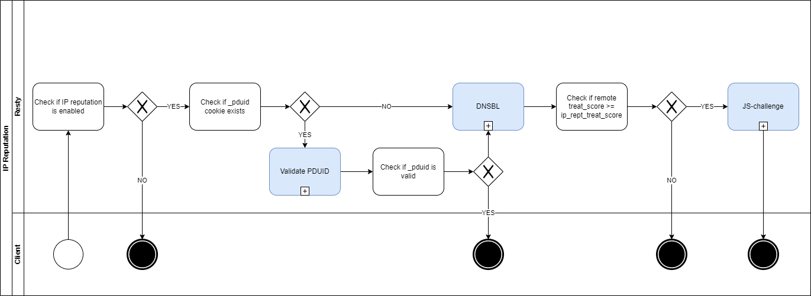

# Resty IP Reputation Example

An implementation of performing DNSBL for incoming remote IP addresses and challenge suspicious ones.



### Install Dependencies

```sh
opm get ktalebian/lua-resty-cookie
opm get tokers/lua-resty-requests
```
### 3rd Parties

- [projecthoneypot](https://www.projecthoneypot.org)
  - [httpbl_api](https://www.projecthoneypot.org/httpbl_api.php)
  - [Threat Rating](https://www.projecthoneypot.org/threat_info.php)

### API Refrence

```
# Type of challege
ip_reputation_challenge = ( block | recaptcha | js )
```
